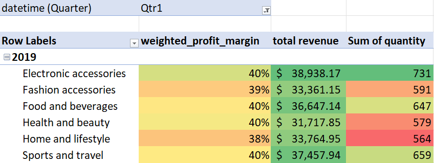
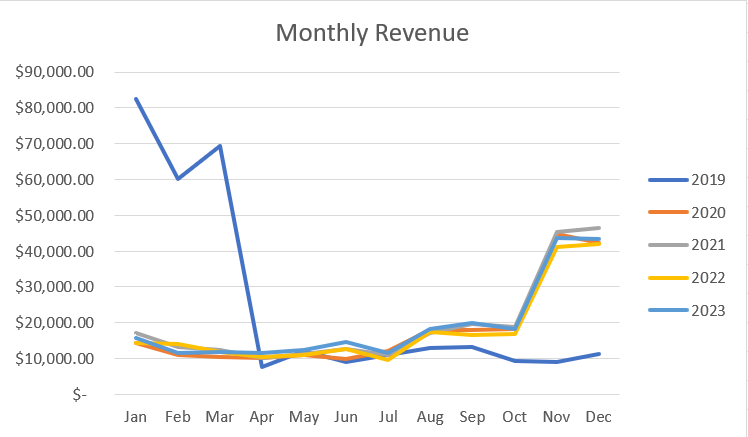
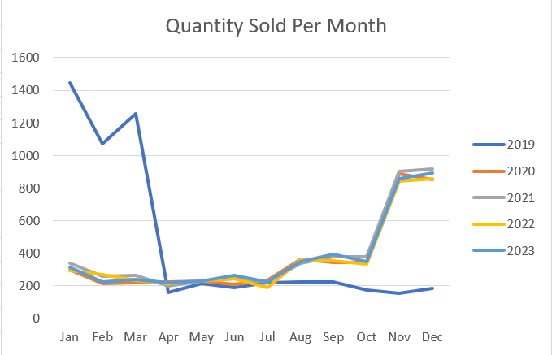
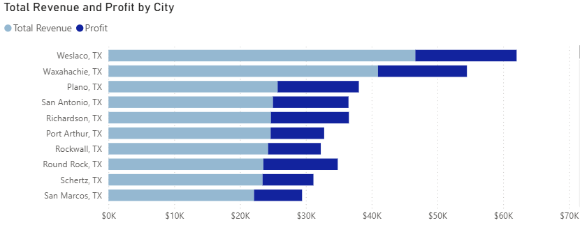
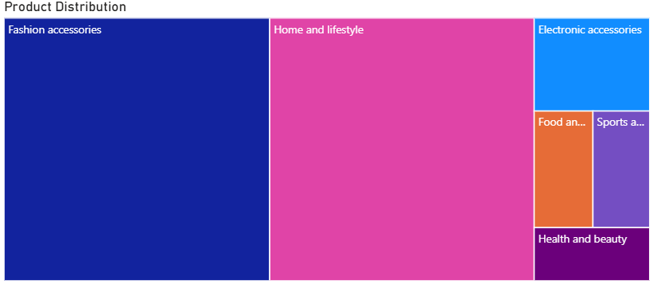
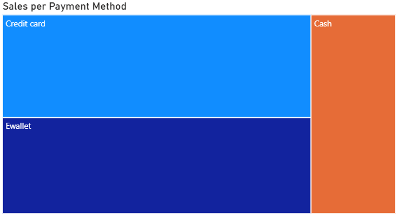
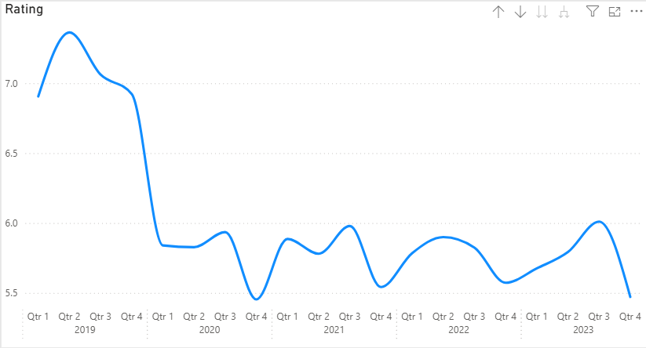

# Walmart-Sales-Data-Analysis

## 1. Background and Overview
This project analyzes Walmart’s sales, profitability, and customer feedback data to uncover trends, anomalies, and performance drivers across categories, cities, branches, and time periods. The ultimate objective is to inform product strategy, marketing campaigns, inventory planning, and operational decision-making.

The analysis leverages pivot tables built in Excel across four main focus areas:

- Revenue & Quantity Trends (time-series and category analysis)

- City & Branch Performance (regional and operational insights)

- Profitability & Correlations (high-margin products, price–margin dynamics)

- Customer Preferences & Ratings (payment behavior, satisfaction trends)

## 2. Data Structure Overview
Tabs Analyzed: walmart_eda.trends, walmart_eda.city_branch, walmart_cleaned.profitability, walmart_cleaned.ratings, walmart_cleaned.correlation

Metrics/Dimensions:

- Time-based: Revenue, Quantity, Profit across years and quarters

- Category-based: Product categories such as Electronics, Home & Lifestyle, Food & Beverages, Health & Beauty, Sports & Travel

- Branch/City-based: Revenue, Quantity, Profit Margin performance per store and city

- Profitability: Unit price, weighted profit margins, category-level profitability

- Customer Behavior: Payment method preferences, ratings distribution, time-series of satisfaction

## 3. Executive Summary
Walmart’s sales analysis of 10,000+ transactions across 2019–2023 highlights shifting category dynamics, evolving customer preferences, and uneven branch performance. Annual sales show a seasonal peak during the holiday months, though a one-time surge in early 2019 suggests the impact of a major launch or promotion. Electronics, once the top driver, have been replaced by Home & Lifestyle and Fashion Accessories, which now account for the majority of both revenue and profit.

Regionally, Weslaco leads overall sales while Mansfield delivers the highest profit margins; however, Lake Jackson and several smaller cities lag significantly in both revenue and volume. Profitability is overwhelmingly category-driven, with Fashion Accessories and Home & Lifestyle contributing nearly 80% of total profit, while unit price and transaction volume show little correlation to margins.

On the customer side, digital payment adoption is high, with credit cards and e-wallets comprising over 70% of transactions. E-wallet users report the highest satisfaction, while cash transactions are lowest in both usage and ratings. Notably, customer ratings have trended downward since 2019, stabilizing at an average of 5.5–6.5, suggesting potential gaps in service or product quality.

These insights point to opportunities for Walmart to strengthen its category mix, invest in high-performing regions, and improve customer experience through expanded digital payment options and targeted satisfaction initiatives.

## 4. Insights Deep Dive
### Revenue and Quantity Trends
- 2019 Q1 anomaly: Electronics generated peak revenues and quantities. Likely tied to launches/promotions.

- Seasonality: Consistent November–December surge points to holiday-driven shopping.

- Category Shifts: From 2020 onward, Home & Lifestyle and Fashion Accessories dominate revenue. Food, Health & Beauty, and Sports & Travel vanished after 2019, requiring investigation into supply or demand changes.

### City and Branch Performance
- Top Performers: Weslaco ($46K) leads in revenue, with Home & Lifestyle driving profit. Mansfield tops profit margin (57%).

- Underperformers: Lake Jackson lowest revenue ($5K) and lowest volume (121 sales). Weatherford, Alice, Canyon, Mineral Wells average only 18% profit margin. Canyon also saw electronics disappear after 2021.

- Branch-Level: WALM074 generates highest revenue ($25K), WALM092 lowest ($5K). WALM052 tops profit margin (57%), WALM069 leads in quantity sold (507).

### Profitability and Correlations
a. Category-Driven Profitability:

- Fashion Accessories & Home & Lifestyle: ~$193K each, together 80% of profits.

- Food & Beverages (40% margin) and Health & Beauty (40%) have high margins but low overall contribution ($18–21K).

- Sports & Travel shows lowest margins (38%) and minimal contribution (~$20K).

b. Price vs Margin: Unit price ($50–57 range) does not significantly impact profit margin (r² ~ 0). Margins depend on category performance.

c. Quantity vs Margin: Weak correlation (r² ~ 0), confirming scale doesn’t drive profitability.

### Customer Preference and Ratings
a. Payment Methods: Digital payments dominate (credit + e-wallet > 70%). Cash is least preferred, with lowest revenue and volume.

b. Ratings Distribution: Most ratings fall between 6–9 (generally satisfied customers).

c. Trend Over Time: Ratings peaked early 2019, then declined and stabilized around 5.5–6.5 post-2020. Indicates a gradual decrease in satisfaction.

d. By Payment Method:

- E-wallet: Highest transaction volume and highest customer satisfaction (avg. 6.48).

- Credit card: Largest sales volume but lower satisfaction (5.42).

- Cash: Lowest usage and lowest satisfaction (5.40).

e. Revenue vs Satisfaction: No strong correlation. Example: Weslaco has high revenue but low rating (5.18), while Austin has the highest rating (7.0) but low revenue ($7.5K).

## 5. Recommendations
### Product & Category Strategy

- Double down on Home & Lifestyle and Fashion Accessories, which drive the majority of revenue and profit.

- Investigate why Food, Health & Beauty, and Sports & Travel vanished post-2019 — supply chain issue or strategic choice?

- Reassess Electronics role post-2019, since its dominance disappeared.

### Sales & Regional Strategy

- Prioritize Weslaco, Mansfield, WALM074, WALM052, WALM069 branches for investment and marketing (high revenue/profit/volume).

- Address underperformance in Lake Jackson, Canyon, WALM092 through targeted promotions, improved product mix, or operational fixes.

### Profitability Strategy

- Focus on scaling Fashion Accessories and Home & Lifestyle categories.

- Recognize that price optimization has minimal impact on margin — instead, allocate resources toward category mix management.

### Customer Experience Strategy

- Expand digital payment options, with incentives for e-wallet use (highest satisfaction).

- Investigate drivers behind ratings decline post-2019, potentially related to service quality or product availability.

- Target campaigns in cities with high satisfaction but low revenue (e.g., Austin) to convert goodwill into sales.
